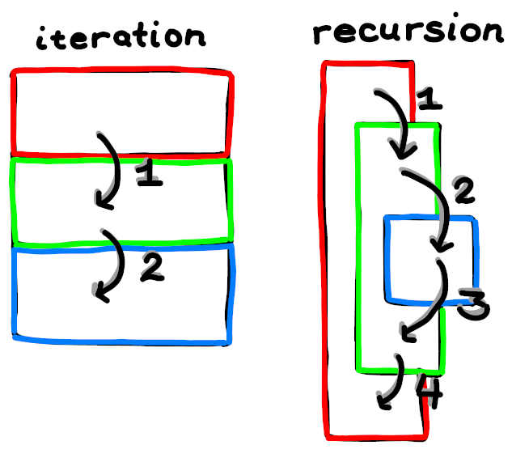

# Introduction To Recursion

## Background expectations

* NO knowledge of recursion
* basic understanding of C++ syntax
* understanding of iterative looping (while, for, do..while)

## Overview

This guide will teach you the basics of recursion and will point you to further readings and exercises to help you master the ideas behind recursion.

We will start with an overview of iteration, introduce recursion abstractly, then we will discuss the scenarios that iteration falls short in. This should enable you to use both iteration *and* recursion, interchangeably as valuable tools in your toolbox.

## Iteration Review

Why do we need to loop at all? The problem is that there are actions we find ourselves repeating, and it makes more sense to have those actions repeated based on a condition.

For example, if we have an action (printing a phrase), and we want to repeat that action a certain number of times (EG: 4 times), we can turn this:

```c++
cout << "Hello World!" << endl;
cout << "Hello World!" << endl;
cout << "Hello World!" << endl;
cout << "Hello World!" << endl;
```

Into this:

```c++
for (int i = 0; i <= 3; ++i) {
 cout << "Hello World!" << endl;
}
```

This approach is called "iteration", because we **iteratively** perform our action and change our condition.

This change might be to increment, decrement, or change the variable in any other way that a variable can be changed. It might not even change at all if we want it to run indefinitely. In the simplest case we usually just increment a counter with a less-than condition, like in the above example.

## Recursion Introduction

### Preface

In order to avoid giving you too much information all at once, I will start you off with a lie about recursion; a lie of omission. I will oversimplify it, and gradually introduce more detail, until you have a more complete understanding of it.

I will let you know when I'm oversimplifying, either explicitly, or by a qualification, like:
> "Using recursion in this way *is like*..."
But any oversimplifications will be cleared up further in the guide.

### How It Works (In-General)

As an overly simple look at recursion, it works much like iteration, but has the following general differences:

* Looping is implemented by entering, and re-entering a function.
* State variables need to be parameters
  * EX: If you wanted a counter 'i' for each recursive loop, it would have to
    be a parameter.
* Loops can be paused, and have other recursive loops run in the middle of them.

That last point is recursion's most powerful benefit, but it's also the hardest to grasp.

Here's a visual demonstration, I will represent a looped action like this:

```c++
{
 //action
}
```

...and if I wanted to loop an action three times iteratively, it might look like
this:

```c++
{
 //action
}

{
 //action
}

{
 //action
}
```

Now, here's the important part, iteration is only capable of doing the above, but recursion is able to do this:

```c++
{
 //action
 {
  //action
  {
   //action
  }
 }

 // POST-action
}
```

Iteration is **incapable** of doing this.

In the above diagram, the first action can do the other two loops, return to it's own loop after pausing, and do more actions!

Please take your time to make sure that above diagram makes sense to you. You don't have to understand how to implement it yet, just recognize what the diagram is saying. Having this intuition about recursion is crucially important to using it where it's appropriate. Here is an alternative diagram illustrating this same idea: .

If you notice how the recursive diagram looks like a "stack" of functions, that's because it's actually a pretty good analogy, and that's what people refer to when they mean "the stack". Your operating system calls and returns from functions recursively.

The applications of this are really crucial, widespread, and very important. Recognizing how to use recursion for these cases makes certain hard problems *very* easy.

I won't talk about specific problems—or applications,yet—but we will get there soon. In general though, if a problem requires any of the following, it's usually incredibly hard to do with iteration, and relatively simple with recursion:

* backtracking
* splitting/forking
* arbitrary levels of nested loops
