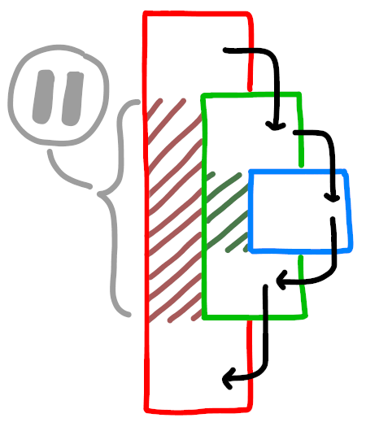

# Converting Iteration to Recursion

## Overview

All iterative approaches can be converted to recursive ones. This will hardly be useful in practice, but it is a good way to get a feel for the syntax and mechanical parts of recursion.

We will start with this less-than-useful example so you can understand how to make a basic loop with recursion.

You *may* spend a while on this step in the guide, because this is where we really start to develop our intuition on the recursive process. It's fine if it takes you a while, just let it sink in, and read over this multiple times if it helps the concept solidify properly.

## sum.cpp

### Background

I have written you a completed example. This shows how to take an iterative function and convert it to a recursive one.

I will assume you have the file open and have read through it (and ran it), and that you now have a good idea of how the iterative solution works, and maybe an idea about how the recursive function is set up, and how it works as well.

I will narrate **here** the function implementations so that you can understand the conversion process yourself.

### Step-By-Step

#### Iterative

In the `sum_iterative` function, we have a function that takes three parameters: start, stop, and step. These functions sum up a list of numbers which begin at the value `start`, and add the `step` value each time until the `stop` value is reached. The sum of all of these values is returned.

1. An empty `sum` variable is made, this will store the sum as the loop iterate.
2. A counter variable `i` is initialized to the `start` value. This will be our iterative loop condition variable.
3. The counter is incremented by the value `step` on each loop, and this counter is added into the sum.
4. When we reach our **exit condition**, where our counter is no longer `<=` the `stop` value, we leave the loop.
5. The function returns the calculated sum.

In the above example, the actions contained within the loop are steps 2. through 4..

#### Recursive

In the `sum_recursive` function, some things are the same, like the parameters, but we are given more freedom in how we loop. This also means that we need to be more explicitly clear in *how* we loop. More freedom means more specifying.

In a normal iterative solution, we only specify what we do while we are still in that loop. This can be seen as what happens in-between our `for` loop's braces.

In recursion, we can not only specify what we do inside our loop, but what we do before our loop, what we do after our loop, and what we do if we are no longer looping. Because we can continue our function after we pause and enter another loop, we have the flexibility, and requirement to explicitly mention what happens when.

To tie those possibilities to what you see in the recursion example:

* inside our loop: everything inside the if statement on line 37
* before the loop: anything above the `sum_recursive(...)` call on line 38
* after the loop: anything under the `sum_recursive(...)` call on line 38
* what we do if we are no longer looping: anything in the else block on line 40

The loop call, AKA the recursive call, happens on line 38, and this is how recursion performs it's looping. Anything before it happens before the loop, and anything after it happens after it returns.

We aren't using all of our options, because we don't really do anything before or after our loop, but they *are* options.

When a function call happens, the running of the function will pause until that function is completed (see ). Then anything you put before or after this call will happen before or after the call.

The case where we no longer loop, has a special name. It is called a **base case**. You can actually have multiple reasons to exit a recursive loop, just like in an iterative loop. This also means you can have multiple base cases. The analogy between iteration and recursion for this idea is loop exit conditions, VS. recursive base cases.

## reverse.cpp

I've written a simple iterative function, and am now tasking you to convert it to a recursive one, yourself. This should help you commit the looping framework to memory.
