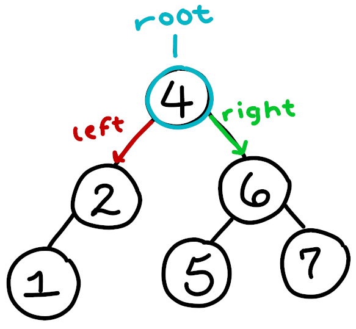
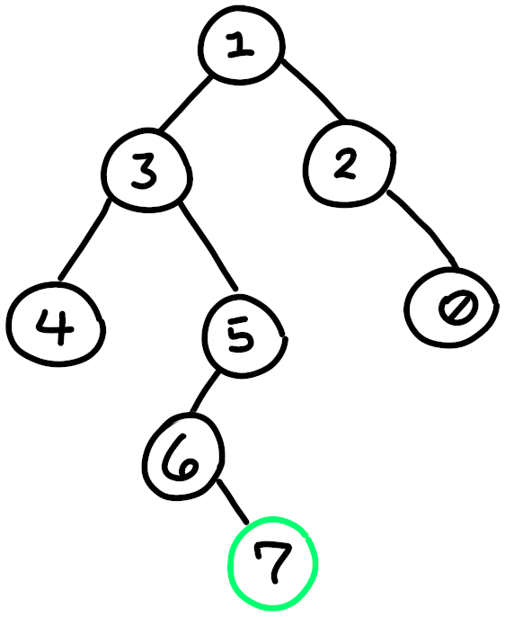
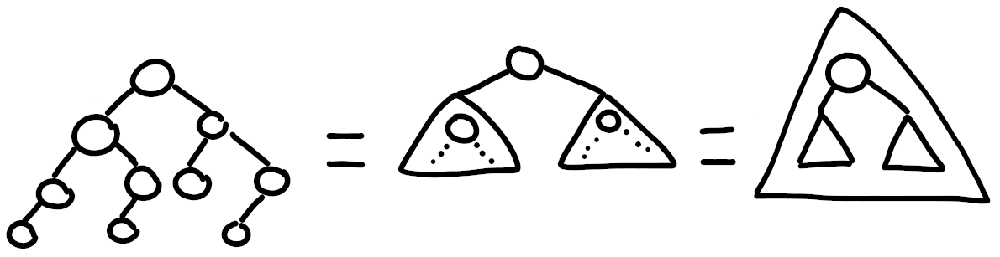

# Anatomy of a Recursive Function

So far, you've been introduced to recursion as a general concept, and have had a bit of syntax practice with the general idea. It's now time to begin formalizing what makes something categorically recursive.

## Motivation

In order to get the most out of recursive functions, it helps to understand the structure that they take, and what purpose that structure confers.

## Anatomy

There are three main components to a recursive function:

* **Recursive calls:** your entry, and looping in recursion
* **Function logic:** what your function does, and the path it takes to evenually terminate
* **Base cases:** where and why your functions terminate

A recursive call is simply a function call, wherever you want to continue your looping behavior. These are important to note as a category because, within a single call, you may choose to:

* 1 *or more* recursive calls within your logic
* Pass differing data to any of these calls
* Choose not to recurse at all, in your base case

Reading the above makes it sound like you need to decide where you go, based on certain conditions. That is exactly it though, you decide where to recurse and how, with conditionals.

Trivially, in our `sum.cpp` file, from the previous lesson, we had a single branch, a single conditional `if` statement. It's not overly exciting, but many simple recursive functions end up looking like this. If—instead—we have multiple branches, then we can change our recursive behavior. One of the simplest examplest examples of this, that is not contrived, is in searching a tree.

> Aside: if you are unfamiliar with binary trees, it's not crucial that you understand them entirely, but they are useful when discussing recursion. A binary tree is like a linked list, except that at each step, the path from the node forks into two directions (typically "left" and "right"). This has some handy properties, but for now just be aware that this is the kind of data structure "shape" you're dealing with. I only bring it up because recursion is uniquely equipped to deal with trees. Below is an image of a simple binary tree.\


### Base Cases

Base cases are a core component of recursion. Recursion can balloon out of hand and explode exponentially, it can also veer off wildly if we don't write our logic correctly. Poorly written—or absent—base cases result in stack overflows, and nasty behavior that's hard to debug. This is a close cousin to the infinite loops you have had to deal with in a `while` loop. These have many of the same causes as iterative logical loop errors:

* Not moving towards your base cases properly (like forgetting to increment)
* Not checking the right conditions
* Not checking *enough* conditions

As an example for a point of comparison, an iterative condition, and base cases in recursion can be equivalently written like so:
```c++
while ((a > 5) and not Even(x)) {
    a -= 1;
    ++x;
}
```

...and we could write our recursive function like this:
```c++
void f(int& a, int& x) {
    if (a <= 5)
        break;
    if (Even(x))
        break;

    a -= 1;
    ++x;
    f(a, x);
}
```

## Trees, Base Cases, Shape: Intuition

Recursion doesn't make much intuitive sense until we tackle something that iteration isn't prepared to handle. Unfortunately that means that we have to come up with an example that isn't so simple. The simplest such case is a binary tree.

Let's think of a binary tree, and try and solve a problem iteratively. We will fail, but we can then solve it recursively and begin to see the magic.\


Let's say we wanted to formalize a function that can tell us if a number is in the tree or not. For example, if we asked if the tree contains the number `9` it would return `false`, but `7` would return true. How would we do that with iteration? If we start at 1:

* Check if left is a 7?
* Check if right is a 7?

Then what? If we go down the left side, we lose the right side. We can't just nest another loop to check the next level, because we don't know how many levels there are. If we just keep going left, then we can't come back later and check out the other side... that is, not without recursion. Remember, recursion lets us pause our functions, it lets us enter the loop multiple times, and it lets us do stuff after we recurse. In iteration we can't just pause, check out the left side, then check out the right side after, but recursion lets us do exactly that.

It might help to think of iteration as following a path. You add a counter, change a condition, and move towards a certain goal. You head in a direction, until you reach it or fail somehow.

Recursion is different. If iteration is following a path, then recursion is more like checking a shape. You perform your logic on your current loop, but then you recurse to fit the shape of the path you're traveling.

This becomes more clear if we solve the above problem with recursion, let's work through it, step-by-step:

1. Identify our base case(s):
  * We aren't in a `Node` anymore (this is like reaching `nullptr` in a regular list; end of the line)
  * We found the number we're looking for!
2. Identify how we are recursing, what shape are we checking?
  * We are searching a tree, we have to check the left and right

Because of this shape, we typically abstract a tree to it's base "shape", a Node, left subtree, and right subtree:\


Notice how the tree contains trees on the left and right. Recursion is perfectly suited to problems that have self-similarity, or regular patterns like this.

Now that we've identified the anatomy of our recursive problem, lets put them together:
```c++
bool Tree::contains(const Node* current_node, int datum) const {
    if (current_node == nullptr) { // base case 1: failed to find
        return false;
    }
    if (current_node->data == datum) { // base case 2: succeeded in finding!
        return true;
    }

    // recursive calls, check left, then check right
    bool left_contains = contains(current_node->left, datum);
    bool right_contains = contains(current_node->right, datum);

    // function logic: return true if any side contained the value (..so use *or*)
    return left_contains or right_contains;
}
```

..and that's the whole function! Just like magic! None of the crazy backtracking, or weird function logic that iteration would have us do. Recursion thrives in cases where we have to iterate in a patterend way.
